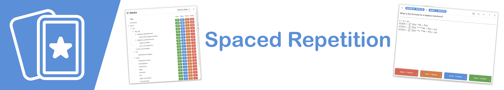
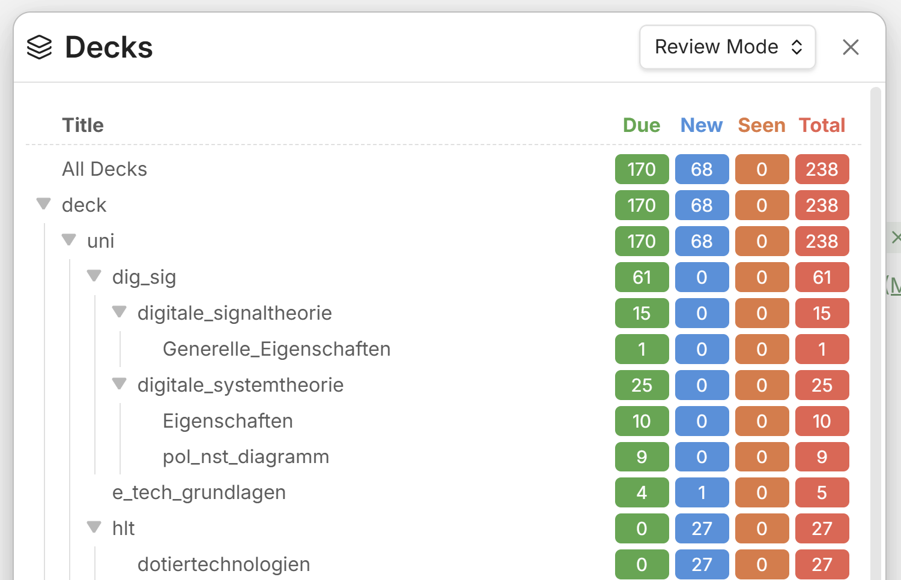
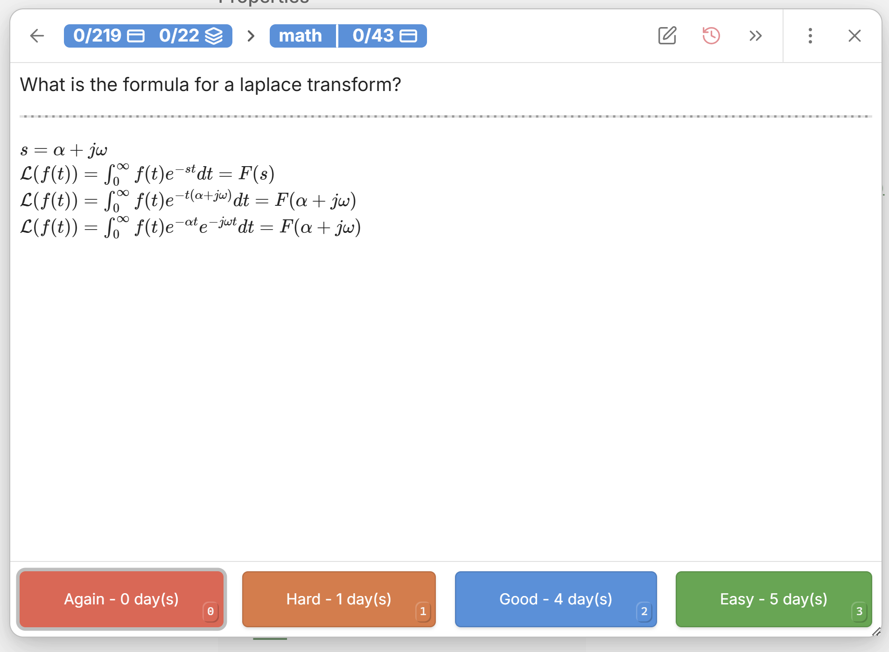

# GAOKAO Obsidian Learning Tracker

当前发布：**0.1.0-rc.1-gaokao.2** · 保留 R1–R5 v0.2 完整实现。

[最新版安装包](https://github.com/wangfrances513-hue/gaokao-obsidian-learning-tracker/releases/latest) · [本版说明](docs/releases/0.1.0-rc.1-gaokao.2.md) · [快速上手](docs/Obsidian-GAOKAO学习系统快速上手.md) · [从零 SOP](docs/learning-examples/00-开始这里/03-GAOKAO插件从零上手SOP.md) · [六科通用 Prompt](docs/learning-examples/提示词/六科高精度泛用Prompt.md) · [示例导航](docs/learning-examples/00-开始这里/00-示范库主页.md) · [写入规范](docs/R1-R5写入规范.md)

## 安装与更新

GitHub 自动生成的 Source code ZIP 不是插件安装包。下载本版 `gaokao-obsidian-learning-tracker-v0.1.0-rc.1-gaokao.2.zip`，或同一发布中的 **main.js、manifest.json、styles.css** 三个文件。放入 `<目标 Vault>/.obsidian/plugins/obsidian-spaced-repetition/` 并在该 Vault 启用 Spaced Repetition。更新前备份旧三文件与 data.json；仅替换三个插件文件，保留真实 data.json、笔记、图片和排期。示例库不需要安装插件，也不能把其数据复制到个人学习库。

## 当前工作流

R1 确认来源与 Entity → R2 无答案 Prompt 尝试 → R3 Cues 回忆 → R4 陌生同构题 practice → R5 现实 verification。无评分默认逐轮推进，R2/R3 显式 Good/Easy 快进 R5，Again/Hard 保留历史并走默认下一轮；R1 所有评分都进入 R2。R5 完成后保持 R5，并不表示掌握或通过考试。

“完成本轮”每次只记一条相应事件；“仅记录普通历史事件”不推进 Round。scheduler 是唯一排期写入者，Today 按到期、最低建议和推荐学习组织行动；不引入普遍时长估计、第二 scheduler 或新的掌握度字段。R1–R4 不走新计时路径，R5 时长仅适用于明确的 Isolated 单题速度验证。

文字和图片共用十个标准区块，完整原图和实际 SHA 进入 Original Evidence。入库不自动产生学习事件或评分。保留原件，禁止用占位题面或假来源冒充可用材料。

## 验证边界与隐私

本版包含已交付的完整实现、文档与合成示例，没有采用消融删减变体。类型检查、定向测试和示例结构检查各自记录结果；原消融总体结论仍是 **INCONCLUSIVE**。原生首帧、真实进程恢复等不能由自动化或一次正常截图证明，不宣称完整运行验收或学习收益。

公开内容不包含个人 Vault、真实 data.json、学习事件、排期、私人题图、本机路径或本地实验原始证据。示例为写法素材，不是已完成学习。插件不会把个人学习数据同步到此源码仓库。

本项目是基于 [st3v3nmw/obsidian-spaced-repetition](https://github.com/st3v3nmw/obsidian-spaced-repetition) 的独立发行版，保留原作者归属和 MIT 许可，不是上游官方发布。以下上游说明只介绍继承的通用能力；GAOKAO 操作以以上本版中文指南为准。

---

# Upstream: Obsidian Spaced Repetition Plugin



   

Fight the forgetting curve by reviewing flashcards & notes using the FSRS or the SM-2 [spaced repetition](https://en.wikipedia.org/wiki/Spaced_repetition) algorithms.

- For more information on how to use the plugin, check either the TL;DR on this page or the [documentation](https://stephenmwangi.com/obsidian-spaced-repetition/).
- Raise an [issue](https://github.com/st3v3nmw/obsidian-spaced-repetition/issues/) if you have a feature request or a bug report.
- Visit the [discussions](https://github.com/st3v3nmw/obsidian-spaced-repetition/discussions/) section for Q&A help, feedback, and general discussion.
- The plugin has been translated into _Arabic, Chinese, Czech, Dutch, French, German, Italian, Korean, Japanese, Polish, Portuguese, Spanish, Russian, Turkish, and Ukrainian_ by the Obsidian community 😄.
    - To help translate this plugin to your language, check the [translation guide here](https://stephenmwangi.com/obsidian-spaced-repetition/contributing/#translating_1).

<br/>

## Features⚡

#### Reviewing Flashcards🗃️

- [Getting started](https://stephenmwangi.com/obsidian-spaced-repetition/flashcards/flashcards-overview/) (Using Obsidian's hierarchical tags or folder structure)
- Creating Flashcards
    - [Single-line style](https://stephenmwangi.com/obsidian-spaced-repetition/flashcards/q-and-a-cards/#single-line-basic) (`Question::Answer`)
    - [Single-line reversed style](https://stephenmwangi.com/obsidian-spaced-repetition/flashcards/q-and-a-cards/#single-line-bidirectional) (`Question:::Answer`)
    - [Multi-line style](https://stephenmwangi.com/obsidian-spaced-repetition/flashcards/q-and-a-cards/#multi-line-basic) (Separated by `?`)
    - [Multi-line reversed style](https://stephenmwangi.com/obsidian-spaced-repetition/flashcards/q-and-a-cards/#multi-line-bidirectional) (Separated by `??`)
    - [Cloze cards](https://stephenmwangi.com/obsidian-spaced-repetition/flashcards/cloze-cards/) (`==highlight==` your cloze deletions!, `**bolded text**`, `{{text in curly braces}}`, or use custom cloze patterns)
    - Rich text support in flashcards (inherited from Obsidian)
        - Images, Audio, & Video
        - LaTeX
        - Code syntax highlighting
        - Footnotes
- [Organize Decks](https://stephenmwangi.com/obsidian-spaced-repetition/flashcards/decks/) (Using Obsidian's hierarchical tags or folder structure)
- [Card context - automatic titles based on headings](https://stephenmwangi.com/obsidian-spaced-repetition/flashcards/reviewing/#context) (i.e. `Note title > Heading 1 > Subheading`)

#### Reviewing Notes📄

- [Getting started](https://stephenmwangi.com/obsidian-spaced-repetition/notes/)
- [Due Notes for review](https://stephenmwangi.com/obsidian-spaced-repetition/notes/#note-review-queue)
- [How to review a note](https://stephenmwangi.com/obsidian-spaced-repetition/notes/#reviewing)

#### [Statistics📈](https://stephenmwangi.com/obsidian-spaced-repetition/flashcards/statistics/)

<br/>
<br/>

## Usage TL;DR🚀

### Creating Decks

1. Add the tag `#flashcards` in a note, where you want to write your cards
2. If you want to have your cards in a specific sub deck, then add your sub deck name to the tag like so: `#flashcards/YOUR_SUB_DECK_NAME`
3. Write your card in the note which where you've added your tag

<br/>

### Creating Cards

##### 1. Decide what card type you need:

- Single line -> Card format:
  `Question::Answer`
- Single line reversable -> Card format:
  `Question:::Answer`
- Multi line -> Card format:
    ```
    Question
    ?
    Answer
    ```
- Multi line reversable -> Card format:
    ```
    Question
    ??
    Answer
    ```

##### 2. Write your card (In one of those formats) in a note that you have tagged as a deck

<br/>

### Reviewing Cards

##### 1.1. Open the list of all decks with either of two commands(ctrl+p):

- _Review Flashcards from all notes_
  -> Here the algorithm decides based on your past reviews, which cards are due to review
- _Select a deck to cram_
  -> All decks and all cards are reviewable and the algorithm is fully ignored

##### 1.2. Or open the list of all decks within your currently opened note(ctrl+p):

- _Review flashcards in this note_
  -> Here the algorithm decides based on your past reviews, which cards from this note are due to review
- _Cram flashcards in this note_
  -> All decks and all cards from this note are reviewable and the algorithm is fully ignored



##### 2. Select a deck via the list and click on the deck name

##### 3. Rate your ability to remember the answer to the current question

- This tells the algorithm what you know well and what you don't



<br/>

### Creating & reviewing whole notes

Sometimes it makes more sense to recall a whole note, when it isn't just pure facts which you have to learn.
This is where marking a note for review comes in handy.

1. Just like with decks add the tag `#review` to your note to mark them as reviewable
2. To see which notes are due for review open the note review queue via the command(ctrl+p): _Open Notes Review Queue in sidebar_
3. There you can open up the notes for review, just as if you would open them up in your file explorer, only that they are sorted her by when they are due for review
4. Once you have recalled/reviewed your note you can rate your recall ability by executing the command(ctrl+p, or just via the 3 dots next to the note): _Review note as YOUR_RATING_ - The algorithm will take your rating into account to calculate a new due date, when you have to review it again
   <br/>

## Links & Resources🔗

- [Documentation](https://stephenmwangi.com/obsidian-spaced-repetition/).
- [Roadmap](https://github.com/st3v3nmw/obsidian-spaced-repetition/projects/3/)
- [Dev News](https://github.com/st3v3nmw/obsidian-spaced-repetition/discussions/categories/development-news)
- [Issues](https://github.com/st3v3nmw/obsidian-spaced-repetition/issues/)
- [Discussions](https://github.com/st3v3nmw/obsidian-spaced-repetition/discussions/)

<br/>

## Support Development💻

<table>
    <thead>
        <tr>
            <th>Stephen Mwangi (Owner)</th>
            <th>Kyle Klus (Maintainer)</th>
        </tr>
    </thead>
    <tbody>
  <tr>
    <td align="center">
        <a href='https://ko-fi.com/M4M44DEN6' target='_blank' style="text-decoration: none;">
            
        </a>
    </td>
    <td align="center">
      <a href="https://github.com/KyleKlus" style="text-decoration: none;">
        
      </a>
    </td>
  </tr>
    </tbody>
</table>
